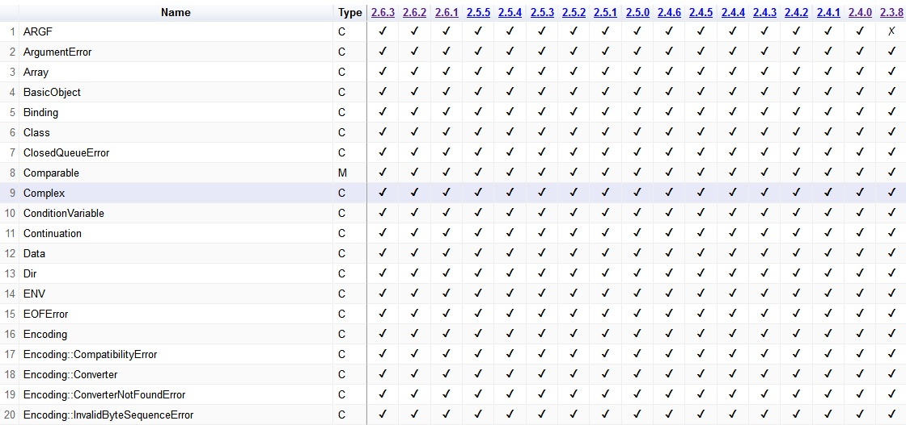

# Screen Shot #

# Usage #
See [my github.io page](https://eroxg.github.io/rubyVersionHistoryTable/rubyVersionHistoryTableEn.html)

OR
1. Save html in docs directory
1. View by  your PC browser
# RubyVersionHistoryTable Description #
Version data comes from the site  [ruby-doc.org](http://ruby-doc.org/) "Core API".  
Not contain "Standard Library API"

## Column ##  
Each Column is sortable. Click column header. For reverting to initial state, reload on your browser.
### Name ###
Name column contain ...  
1. Class name  
 C in "Type" column shows class name.

1. Module name  
M  in "Type" column shows module name.
1. Class method name   
*class_name.method_name* (use dot not ::)
1. Instance method name  
*class_name#method_name*

### Type ###
Type column contain ...
1. **C** Class  
1. **M** Module  
1. **::** Class method  
1. **#** instance method

### Version ###
Other columns show ruby versions. e.g 2.6.3, 2.6.2, and so on. Each column header string is html link to each version page in ruby-doc.org.  
In each cell, [check mark](https://en.wikipedia.org/wiki/Check_mark) means "defined on the version" and[ X mark ](https://en.wikipedia.org/wiki/X_mark)means "not defined on the version".